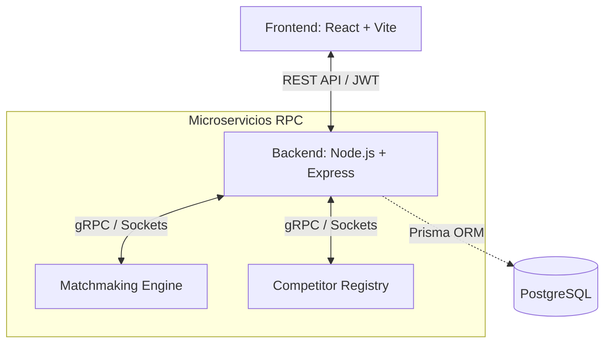

<div align="center">

# 🦾 ARMRANK Enterprise

**Plataforma Integral de Gestión y Ranking para Torneos de Arm Wrestling**

[](https://reactjs.org/)
[](https://nodejs.org/)
[](https://postgresql.org/)
[](https://prisma.io/)
[](https://www.docker.com/)

*Una solución Full-Stack diseñada para gestionar competidores, categorías, enfrentamientos y estadísticas en tiempo real con latencia ultra baja.*

</div>

---

## 🌟 Características Principales

- 🏋️‍♂️ **Gestión de Competidores**: Registro, pesaje y categorización automática.
- 🏆 **Matchmaking Algorítmico**: Generación automática de llaves (brackets) de torneo.
- 📊 **Ranking en Tiempo Real**: Estadísticas, ELO y puntuaciones calculadas al instante.
- 🔌 **Arquitectura Distribuida**: Comunicación basada en RPC para escalabilidad masiva.
- 🐳 **Docker-Ready**: Infraestructura containerizada lista para despliegue en la nube.

---

## 📐 Arquitectura del Sistema



---

## 🛠️ Stack Tecnológico

| Capa | Tecnología | Función |
|---|---|---|
| **Frontend** | React + Vite + TailwindCSS | Interfaz de usuario reactiva y moderna |
| **Backend** | Node.js + Express + RPC | Lógica de negocio y orquestación de servicios |
| **Base de Datos** | PostgreSQL + Prisma ORM | Almacenamiento relacional tipado y seguro |
| **Despliegue** | Docker & Nginx | Containerización y proxy reverso para producción |

---

## 🚀 Despliegue Rápido (Producción)

El sistema está empaquetado para ser desplegado en un solo paso mediante Docker Compose.

### 1. Iniciar los Servicios
Asegúrate de configurar los archivos `.env` (usa `.env.example` como plantilla) y ejecuta:

```bash
docker-compose up -d --build
```

Esto levantará 3 contenedores:
- `armrank_db` (PostgreSQL 15)
- `armrank_backend` (API Node.js en puerto 3001)
- `armrank_frontend` (Cliente React vía Nginx en puerto 80)

### 2. Validar Base de Datos
Para generar el esquema inicial en la base de datos:
```bash
docker exec -it armrank_backend npm run db:deploy
```

---

## 💻 Desarrollo Local

Si deseas modificar el código sin Docker:

1. **Instalar dependencias**:
   ```bash
   cd backend && npm install
   cd ../app && npm install
   ```

2. **Iniciar Backend**:
   ```bash
   cd backend
   npm run dev:all # Levanta el API y los nodos RPC
   ```

3. **Iniciar Frontend**:
   ```bash
   cd app
   npm run dev
   ```

---

## 📂 Organización del Proyecto

Toda la documentación técnica, guías de práctica universitarias y diagramas anteriores se encuentran ahora archivados de forma segura en la carpeta `/docs`. 

```text
ARMRANK/
├── app/             # Frontend React (Vite)
├── backend/         # Node.js API & Prisma
├── docs/            # Documentación académica y técnica (PDFs, DOCX)
├── scripts/         # Utilidades de automatización local
└── docker-compose.yml
```

---
<div align="center">
  <sub>Arquitectura limpia implementada por el equipo de ingeniería de NetFlow</sub>
</div>
